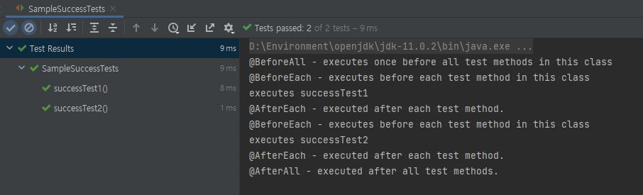
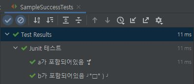
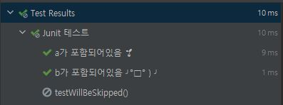
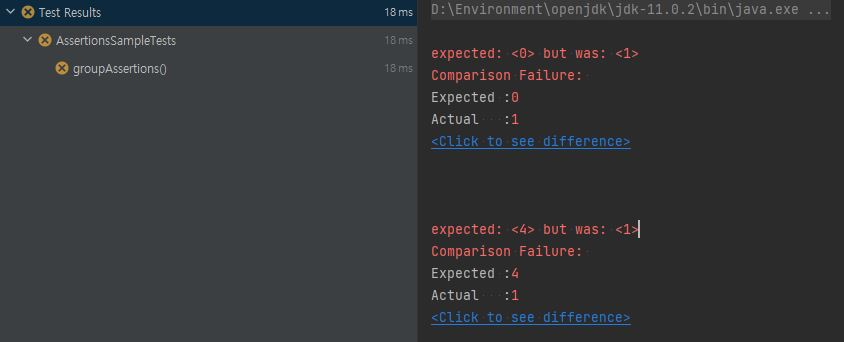
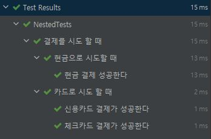

1\. 시작하며
--------

JUnit5는 가장 인기 있는 단위 테스트 프레임 워크이다. JUnit5 의 기본 기능에 대해 알아보자

2\. JUnit5 란?
-------------

> JUnit 5 = JUnit Platform + JUnit Jupiter + JUnit Vintage

*   JUnit Platform : 테스트를 실행해주는 런처 제공, TestEngine API 정의
*   JUnit Jupiter : TestEngine API 구현체로 JUnit5 제공
*   JUnit Vintage : JUnit4와 JUnit43을 지원하는 TestEngine 구현체

### 2.1 JUnit Platform

*   JVM에서 테스트 프레임워크를 시작하기 위한 런처를 제공한다.
*   Junit과 클라이언트 간의 인터페이스를 제공한다.
*   JUnit 플랫폼에서 실행되는 테스트 프레임워크를 개발하기 위한 TestEngine API를 정의한다.

### 2.2 Junit Jupiter

*   테스트 작성을 위한 새로운 프로그래밍 모델과 확장 모델 조합이다.
*   Junit 4 에서 다음 기능이 추가되었다.

@TestFactory – 동적 테스트 지원  
@DisplayName – 테스트 클래스, 테스트 메서드에 대해 사용자 정의하는 이름 노출  
@Nested – 클래스가 중첩된 비정적 테스트 클래스임을 나타냄  
@Tag – 테스트를 필터링하기 위한 태그 선언  
@ExtendWith – custom extensions 등록  
@BeforeEach – 각각의 테스트 메서드 실행 이전에 매번 실행 (JUnit4: @Before)  
@AfterEach – 각각 테스트 메소드 실행 이후에 실행 (JUnit4: @After)  
@BeforeAll – 현재 클래스의 모든 테스트 메서드 실행 이전에 한 번만 실행 (JUnit4: @BeforeClass)  
@AfterAll –현재 클래스의 모든 테스트 메소드 실행 이후에 한번만 실행 ( (JUnit4: @AfterClass)  
@Disable – 테스트 클래스, 테스트 메서드 비활성화 (JUnit4: @Ignore)

### 2.3 JUnit Vintage

*   Junit 5에서 Junit 4와 Junit3가 동작할 수 있도록 지원한다.

3\. JUnit5 시작하기
---------------

*   Java 8 이상에서 동작한다.

### maven dependency 추가

    <dependency>
        <groupId>org.junit.jupiter</groupId>
        <artifactId>junit-jupiter-engine</artifactId>
        <version>5.8.2</version>
        <scope>test</scope>
    </dependency>

4\. 주요 Annotations
------------------

### @BeforeAll / @BeforeEach / @AfterEach / @AfterAll

*   `@BeforeEach`: 각각의 테스트 메서드 실행 이전에 매번 실행 (JUnit4: `@Before`)
*   `@AfterEach`: 각각 테스트 메소드 실행 이후에 실행 (JUnit4: `@After`)
*   `@BeforeAll`: 현재 클래스의 모든 테스트 메서드 실행 이전에 한 번만 실행 (JUnit4: `@BeforeClass`)
*   `@AfterAll`: 현재 클래스의 모든 테스트 메소드 실행 이후에 한번만 실행 ( (JUnit4: `@AfterClass`)

@BeforeAll, @AfterAll 은 static으로 선언되어야 한다.
```java
    import static org.junit.jupiter.api.Assumptions.assumeTrue;
    
    import org.junit.jupiter.api.AfterAll;
    import org.junit.jupiter.api.AfterEach;
    import org.junit.jupiter.api.BeforeAll;
    import org.junit.jupiter.api.BeforeEach;
    import org.junit.jupiter.api.Disabled;
    import org.junit.jupiter.api.DisplayName;
    import org.junit.jupiter.api.Test;
    
    public class SampleSuccessTests {
    
        @BeforeAll
        static void setup() {
            System.out.println("@BeforeAll - executes once before all test methods in this class");
        }
    
        @BeforeEach
        void init() {
            System.out.println("@BeforeEach - executes before each test method in this class");
        }
    
        @AfterEach
        void tearDown() {
            System.out.println("@AfterEach - executed after each test method.");
        }
    
        @AfterAll
        static void tearDownAll() {
            System.out.println("@AfterAll - executed after all test methods.");
        }
    
        @Test
        void successTest1() {
            System.out.println("executes successTest1");
            assumeTrue("abc".contains("a"));
        }
    
        @Test
        void successTest2() {
            System.out.println("executes successTest2");
            assumeTrue("abc".contains("b"));
        }
    }
```
위 코드를 실행해보면 다음과 같다.




### @DisplayName

*   Test Class 나 Test Method에 사용자 정의 이름 지정 가능하다.
*   공백, 특수문자, 이모지 등 입력 가능하며 test report 나 IDE에서 확인 가능하다.
```java
    @DisplayName("성공 테스트")
    public class SampleSuccessTests {

        @DisplayName("a가 포함되어 있음 🌱")
        @Test
        void successTest1() {
            System.out.println("executes successTest1");
            assumeTrue("abc".contains("a"));
        }

        @DisplayName("b 가 포함되어있음 ╯°□°）╯")
        @Test
        void successTest2() {
            System.out.println("executes successTest2");
            assumeTrue("abc".contains("b"));
        }
    }
```


### @Disabled

*   테스트를 비활성화시켜서 테스트를 skip 할 수 있도록 한다.
*   JUnit4의 '@Ignore'와 동일 기능
```java
    import org.junit.jupiter.api.Disabled;
    import org.junit.jupiter.api.Test;

    @Disabled("Disabled until bug #99 has been fixed")
    class DisabledClassDemo {

        @Test
        void testWillBeSkipped() {
        }

    }
```
아래와 같이 테스트가 skip 된다.



환경에 따라서 test를 Skip 하도록 설정 가능하다.
```java
    @Test
    @EnabledIfEnvironmentVariable(named = "ENV", matches = "staging-server")
    void onlyOnStagingServer() {
        // ...
    }
    
    @Test
    @DisabledIfEnvironmentVariable(named = "ENV", matches = ".*development.*")
    void notOnDeveloperWorkstation() {
        // ...
    }
```
5\. Assertions
--------------

*   JUnit Jupiter는 JUnit 4에서 제공하는 Assertions 기능과 더불어 Java 8의 lambda를 지원하는 Assertions 이 추가되었다.
*   JUnit Jupiter assertions 은 `org.junit.jupiter.api.- Assertions`의 `static`로 이동되었다

    @Test
    void lambdaExpressions() {
    List numbers = Arrays.asList(1, 2, 3);
    assertTrue(numbers.stream()
    .mapToInt(i -> i)
    .sum() > 5, () -> "Sum should be greater than 5");
    }

*   `assertAll()` 을 사용하여 Assertion 을 그룹화하여 실행 가능하다.
```java
    @Test
    void groupAssertions() {
    int[] numbers = {0, 1, 2, 3, 4};
    assertAll("numbers",
    () -> assertEquals(numbers[0], 1),
    () -> assertEquals(numbers[3], 3),
    () -> assertEquals(numbers[4], 1)
    );
    }
```


6\. Assumptions
---------------

*   Assumptions 은 특정 조건이 충족될 때만 테스트를 실행한다.
*   즉 특정 조건을 만족하지 않으면 테스트를 더 이상 진행하지 않는다.
*   일반적으로 테스트가 제대로 실행하기 위한 필요한 외부조건에 사용된다. (ex. Dev 환경에서만 테스트)
*   JUnit Jupiter assumptions 은 `org.junit.jupiter.api.Assumptions`의 `static`로 이동되었다
*   `assumeTrue()`, `assumeFalse()`, `assumingThat()`
```java
    @Test
    void testOnlyOnDevServer() {
    // DEV 환경 에서만 test 실행
    assumeTrue("DEV".equals(System.getenv("ENV")));
    assertEquals(1, "a".length(), "is always equal");
    }

    @Test
    void testOnlyOnPrdServer() {
    // PRD 환경이 아닐 때만 test 실행
    assumeFalse("PRD".equals(System.getenv("ENV")));
    assertEquals(4, "real".length(), "is always equal");
    }

    @Test
    void testInAllEnvironments() {
    assumingThat("PRD".equals(System.getenv("ENV")),
    () -> {assertEquals(1, "a".length(), "is always equal");
    });

        assertEquals(3, "all".length(), "is always equal");
    }
```
7\. Exception Testing
---------------------
*   예외를 테스트하는 방법은 두 가지가 있다.
*   `assertThrows` 사용하기
*   `assertEquals` 로 에러 메시지 비교하기

```java
    @Test
    void assertThrowsException() {
    String str = null;
    assertThrows(IllegalArgumentException.class, () -> {
    Integer.valueOf(str);
    });
    }

    @Test
    void shouldThrowException() {
    Exception exception = assertThrows(ArithmeticException.class, () -> {
    int divide = 1/0;
    });
    assertEquals("/ by zero", exception.getMessage());
    }
```
8\. Test Suites
---------------

*   여러 테스트 클래스를 모아서 테스트할 수 있다.
*   `@SelectPackages`, `@SelectClasses`
```java
    import org.junit.platform.suite.api.SelectPackages;
    import org.junit.platform.suite.api.SuiteDisplayName;
    import org.junit.runner.RunWith;

    @RunWith(org.junit.platform.runner.JUnitPlatform.class)
    @SuiteDisplayName("JUnit Platform Suite Demo")
    @SelectPackages("example")
    public class JUnitPlatformSuiteDemo {
    }

    @RunWith(JUnitPlatform.class)
    @SelectClasses({AssertionTest.class, AssumptionTest.class, ExceptionTest.class})
    public class AllUnitTest {

    }
```
9\. Dynamic Tests
----

*   런타임에 생성된 테스트 케이스를 선언하고 실행할 수 있는 JUnit 5의 동적 테스트 기능
*   런타임에서 테스트 케이스를 동적으로 정의할 수 있습니다.
```java
    @TestFactory
    public Stream<DynamicTest> translateDynamicTestsFromStream() {
    return in.stream()
    .map(word ->
    DynamicTest.dynamicTest("Test translate " + word, () -> {
    int id = in.indexOf(word);
    assertEquals(out.get(id), translate(word));
    })
    );
    }
```

10\. Parameter를 사용하여 반복 테스트 하기
---
*   `@ParameterizedTest` 로 파라미터에 따라 반복적인 테스트 수행
*   `@ValueSource`로 테스트에 사용할 변수 지정
```java
    @ParameterizedTest
    @DisplayName("Should create shapes with different numbers of sides")
    @ValueSource(ints = {3, 4, 5, 8, 14})
    void shouldCreateShapesWithDifferentNumbersOfSides(int expectedNumberOfSides) {
    Shape shape = new Shape(expectedNumberOfSides);
    assertEquals(expectedNumberOfSides, shape.numberOfSides());
    }

    @ParameterizedTest(name = "{0}")
    @DisplayName("Should not create shapes with invalid numbers of sides")
    @ValueSource(ints = {0, 1, 2, Integer.MAX_VALUE})
    void shouldNotCreateShapesWithInvalidNumbersOfSides(int expectedNumberOfSides) {
    assertThrows(IllegalArgumentException.class,
    () -> new Shape(expectedNumberOfSides));
    }
```

11. 중첩된 계층구조 테스트 하기
*   중첩된 계층 구조를 가진 테스트 메서드 작성 가능
```java
    import org.junit.jupiter.api.DisplayName;
    import org.junit.jupiter.api.Nested;
    import org.junit.jupiter.api.Test;

    public class NestedTests {
    @Nested
    @DisplayName("결제를 시도 할 때")
    class whenTryPay {

            @Nested
            @DisplayName("카드로 시도 할 때")
            class payWithCard {
                @Test
                @DisplayName("신용카드 결제가 성공한다")
                void successPayWithCreditCard() {

                }
                @Test
                @DisplayName("체크카드 결제가 성공한다")
                void successPayWithDebitCard() {

                }
            }
            @Nested
            @DisplayName("현금으로 시도할 때")
            class payWithCash {
                @Test
                @DisplayName("현금 결제 성공한다")
                void successPayWithCash() {

                }
            }
        }
    }
```



10\. 마치며
--------

JUnit5에 추가된 주요 기능을 확인해보았다.
